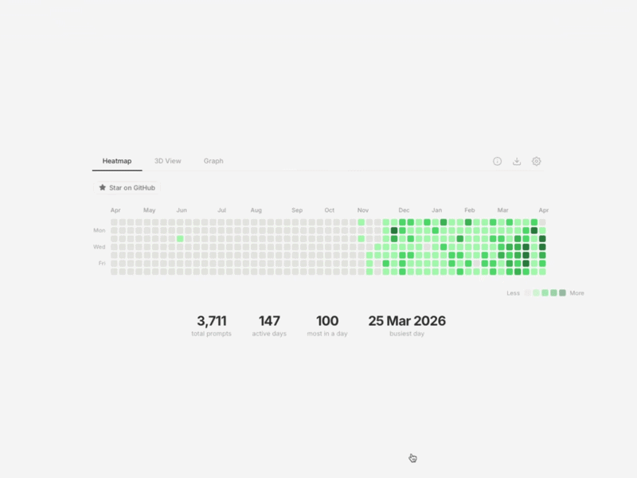

Visualize your Google Gemini activity with a beautiful, GitHub-style heatmap and interactive dashboard. 100% private, 100% local.

## Features
- **GitHub-Style Heatmap**: Track your daily prompts over the last year.
- **3D Visualization**: Explore your activity in an interactive 3D space.
- **Prompt Analytics**: Discover your most used words and frequency charts.
- **High-Quality Export**: Generate and download portrait (1080x1920) summary cards for social media.
- **Privacy First**: All data is parsed locally in your browser. No data ever leaves your device.

## How to Get Your Data
1. Go to [Google Takeout](https://takeout.google.com/).
2. Click **"Deselect all"**.
3. Find **"My Activity"** and select it.
4. Click **"All activity data included"** -> **"Deselect all"** -> select only **"Gemini"**.
5. Create export and wait for the email.
6. Drop your `.zip` or `MyActivity.html` file into the app at [gemini.rot.bio](https://gemini.rot.bio).
   

## License
Open Source. Feel free to use and star! ⭐
